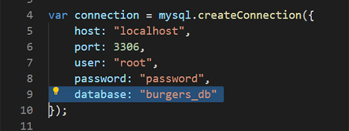

# Unit 13: Eat-Da-Burger

Eat-Da-Burger was created with Javascript, Node Js, Mysql, Express, and Express-handlebars. Live link, , the user inputs the names of burgers they would like to eat. When the user submits a burger name, the name of the burger is displayed on the top of the page waiting to be devoured. When the user clicks on the "Yum Yum!" button, it moves to the "devoured" column below. The app stores every burger made in a database.

## Take aways! 

I couldn't get the server up. I looked through every file in each directory. While doing that several times, I saw little errors like missing "-", ".". And corrected them. But still no beans. The next day, I asked kerwin, he said from the error it can't find the database. I had the name of the database with burgers.db. It should have been "burgers_db". And I thought I was really going slow and double checking my work. 

### Prerequisites
You can see app here: () and/or view files from repository (https://github.com/itsmedexter/burger).  

## Built With
* [HTML](https://developer.mozilla.org/en-US/docs/Web/HTML)
* [CSS](https://developer.mozilla.org/en-US/docs/Web/CSS)
* [Express-Handlebars] (https://www.npmjs.com/package/express-handlebars)
* [MySql] (https://www.npmjs.com/package/mysql)
* [NodeJs] (https://nodejs.org/en/about/)
* [NPM] (https://www.npmjs.com/)

## Deployed Link
* No direct link, please see "Prerequisites" above on how to run "cms.js".

## Authors
Dexter Valencia 

- [Link to Employee Tracker repository](https://github.com/itsmedexter/burger)
- [Link to Github](https://github.com/itsmedexter)
- [Link to LinkedIn](https://www.linkedin.com/in/dextervalencia/)

## License

This project is licensed under the MIT License 

## Acknowledgments

* Thanks to Kerwin guiding/helping me link my prompts to my functions.  
